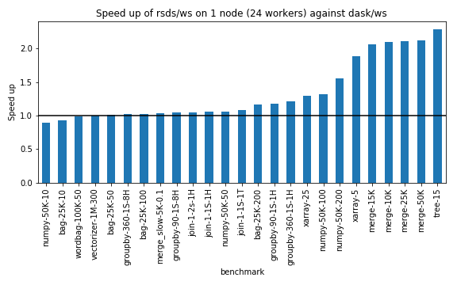
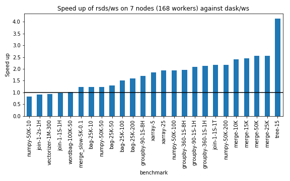

# `RSDS` (Rust Dask Scheduler)
``rsds`` is a Rust implementation of the [Dask/distributed](https://distributed.dask.org) centralized server and scheduler.
It serves mostly as an experiment for evaluating the performance gain of having a Dask server written in a language
without automatic memory management and for benchmarking different scheduling algorithms.

## Disclaimer
Dask/distributed has a very complex feature set and protocol and we do not support most of the advanced features
like dashboard or custom communication protocols (UCX) at this moment. 

If `rsds` can run your use case, you could possibly see some speedup if the scheduler is the bottleneck
of your pipeline. If it isn't, it can be actually slower than Dask, since it uses much simpler scheduling
heuristics. YMMV.

If your pipeline cannot be run by `rsds`, feel free to send us an issue.

## Usage
To compile and use `rsds`, you must have Rust toolchain installed. You can install it using e.g. [Rustup](https://rustup.rs/).

1) Build `rsds`:
```bash
$ RUSTFLAGS="-C target-cpu=native" cargo build --release
```
2) Install our modified version of Dask:
```bash
$ pip install git+https://github.com/Kobzol/distributed@simplified-encoding
```
The modifications that we had to perform to make it manageable to implement the Dask
protocol in Rust are described [here](https://github.com/dask/distributed/pull/3809).
3) Use `rsds-scheduler` instead of `dask-scheduler` when starting a Dask cluster:
```bash
$ ./target/release/rsds-scheduler
```

After that just use `target/release/rsds-scheduler` as you would use `dask-scheduler`.
Be wary that most of the command line options from `dask-scheduler` are not supported though.

## Hello world example
1) Setup a cluster on the local machine
    ```bash
    # run server
    $ ./target/release/rsds-scheduler
    # run worker
    $ dask-worker localhost:8786
    ```

2) Run a simple example that uses Dask dataframe:
    ```python
    import dask
    from dask.distributed import Client
    
    client = Client("tcp://localhost:8786")
    
    df = dask.datasets.timeseries(start="2020-01-01", end="2020-01-03")
    result = df.groupby("name")["x"].mean().compute()
    print(result)
    ```

## Benchmarks
You can find a set of benchmarks in the `script` folder. Here are some result of comparing `RSDS` and `Dask`
on 1 and 7 node clusters with 24 workers per node.





## Reports

* https://github.com/dask/distributed/issues/3139
